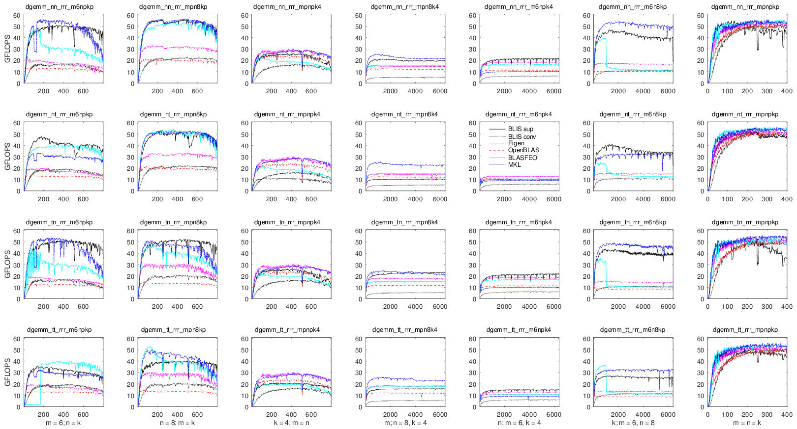
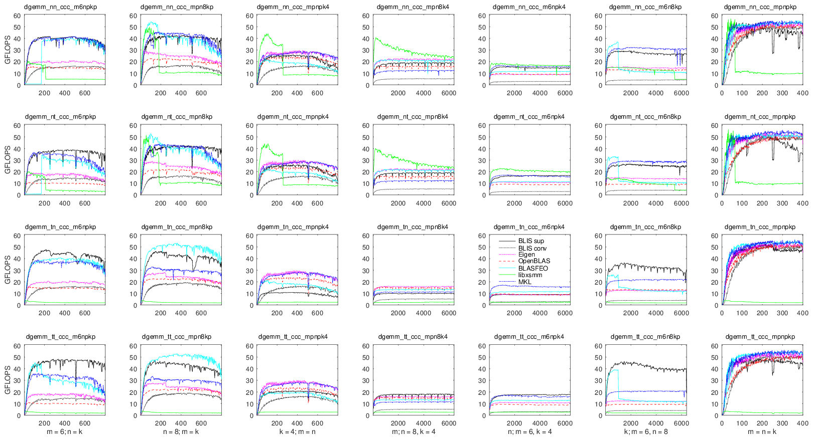
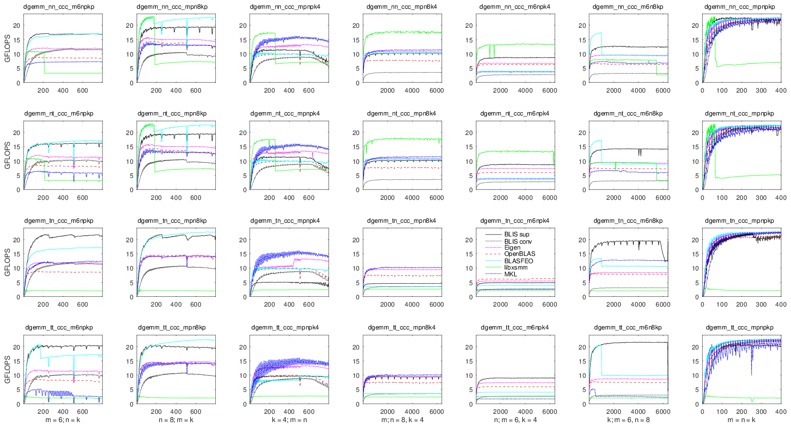

# Contents

* **[Contents](Performance.md#contents)**
* **[Introduction](Performance.md#introduction)**
* **[General information](Performance.md#general-information)**
* **[Level-3 performance](Performance.md#level-3-performance)**
  * **[Kaby Lake](Performance.md#kaby-lake)**
    * **[Experiment details](Performance.md#kaby-lake-experiment-details)**
    * **[Results](Performance.md#kaby-lake-results)**
  * **[Epyc](Performance.md#epyc)**
    * **[Experiment details](Performance.md#epyc-experiment-details)**
    * **[Results](Performance.md#epyc-results)**
* **[Feedback](Performance.md#feedback)**

# Introduction

This document showcases performance results for the level-3 `gemm` operation
on small matrices with BLIS and BLAS for select hardware architectures.

# General information

Generally speaking, for level-3 operations on small matrices, we publish 
two "panels" for each type of hardware, one that reflects performance on
row-stored matrices and another for column-stored matrices.
Each panel will consist of a 4x7 grid of graphs, with each row representing
a different transposition case (`nn`, `nt`, `tn`, `tt`)
complex) and each column representing a different shape scenario, usually
with one or two matrix dimensions bound to a fixed size for all problem
sizes tested.
Each of the 28 graphs within a panel will contain an x-axis that reports
problem size, with one, two, or all three matrix dimensions equal to the
problem size (e.g. _m_ = 6; _n_ = _k_, also encoded as `m6npkp`).
The y-axis will report in units GFLOPS (billions of floating-point operations
per second) on a single core.

It's also worth pointing out that the top of each graph (e.g. the maximum
y-axis value depicted) _always_ corresponds to the theoretical peak performance
under the conditions associated with that graph.
Theoretical peak performance, in units of GFLOPS, is calculated as the
product of:
1. the maximum sustainable clock rate in GHz; and
2. the maximum number of floating-point operations (flops) that can be
executed per cycle.

Note that the maximum sustainable clock rate may change depending on the
conditions.
For example, on some systems the maximum clock rate is higher when only one
core is active (e.g. single-threaded performance) versus when all cores are
active (e.g. multithreaded performance).
The maximum number of flops executable per cycle (per core) is generally
computed as the product of:
1. the maximum number of fused multiply-add (FMA) vector instructions that
can be issued per cycle (per core);
2. the maximum number of elements that can be stored within a single vector
register (for the datatype in question); and
3. 2.0, since an FMA instruction fuses two operations (a multiply and an add).

The problem size range, represented on the x-axis, is sampled in
increments of 4 up to 800 for the cases where one or two dimensions is small
(and constant)
and up to 400 in the case where all dimensions (e.g. _m_, _n_, and _k_) are
bound to the problem size (i.e., square matrices).

Note that the constant small matrix dimensions were chosen to be _very_
small--in the neighborhood of 8--intentionally to showcase what happens when
at least one of the matrices is abnormally "skinny." Typically, organizations
and individuals only publish performance with square matrices, which can miss
the problem sizes of interest to many applications. Here, in addition to square
matrices (shown in the seventh column), we also show six other scenarios where
one or two `gemm` dimensions (of _m,_ _n_, and _k_) is small.

The legend in each graph contains two entries for BLIS, corresponding to the
two black lines, one solid and one dotted. The dotted line, **"BLIS conv"**,
represents the conventional implementation that targets large matrices. This
was the only implementation available in BLIS prior to the addition to the
small/skinny matrix support. The solid line, **"BLIS sup"**, makes use of the
new small/skinny matrix implementation for certain small problems. Whenever
these results differ by any significant amount (beyond noise), it denotes a
problem size for which BLIS employed the new small/skinny implementation.
Put another way, **the delta between these two lines represents the performance
improvement between BLIS's previous status quo and the new regime.**

Finally, each point along each curve represents the best of three trials.

# Interpretation

In general, the the curves associated with higher-performing implementations
will appear higher in the graphs than lower-performing implementations.
Ideally, an implementation will climb in performance (as a function of problem
size) as quickly as possible and asymptotically approach some high fraction of
peak performance.

When corresponding with us, via email or when opening an
[issue](https://github.com/flame/blis/issues) on github, we kindly ask that
you specify as closely as possible (though a range is fine) your problem
size of interest so that we can better assist you.

# Level-3 performance

## Kaby Lake

### Kaby Lake experiment details

* Location: undisclosed
* Processor model: Intel Core i5-7500 (Kaby Lake)
* Core topology: one socket, 4 cores total
* SMT status: unavailable
* Max clock rate: 3.8GHz (single-core)
* Max vector register length: 256 bits (AVX2)
* Max FMA vector IPC: 2
* Peak performance:
  * single-core: 57.6 GFLOPS (double-precision), 115.2 GFLOPS (single-precision)
* Operating system: Gentoo Linux (Linux kernel 5.0.7)
* Compiler: gcc 7.3.0
* Results gathered: 31 May 2019
* Implementations tested:
  * BLIS 6bf449c (0.5.2-42)
    * configured with `./configure --enable-cblas auto`
    * sub-configuration exercised: `haswell`
  * OpenBLAS 0.3.6
    * configured with `BINARY=64 NO_LAPACK=1 NO_LAPACKE=1 USE_THREAD=0` (single-threaded)
  * Eigen 3.3.90
    * Obtained via the [Eigen git mirror](https://github.com/eigenteam/eigen-git-mirror) (30 May 2019)
    * Prior to compilation, modified top-level `CMakeLists.txt` to ensure that `-march=native` was added to `CXX_FLAGS` variable (h/t Sameer Agarwal).
    * configured and built BLAS library via `mkdir build; cd build; cmake ..; make blas`
    * The `gemm` implementation was pulled in at compile-time via Eigen headers; other operations were linked to Eigen's BLAS library.
    * Requested threading via `export OMP_NUM_THREADS=1` (single-threaded)
  * MKL 2018 update 4
    * Requested threading via `export MKL_NUM_THREADS=1` (single-threaded)
* Affinity:
  * N/A.
* Frequency throttling (via `cpupower`):
  * Driver: intel_pstate
  * Governor: performance
  * Hardware limits: 800MHz - 3.8GHz
  * Adjusted minimum: 3.7GHz
* Comments:
  * For both row- and column-stored matrices, BLIS's new small/skinny matrix implementation is competitive with (or exceeds the performance of) the next highest-performing solution (typically MKL), except for a few cases of where the _k_ dimension is very small. It is likely the case that this shape scenario begs a different kernel approach, since the BLIS microkernel is inherently designed to iterate over many _k_ dimension iterations (which leads them to incur considerable overhead for small values of _k_).
  * For the classic case of `dgemm_nn` on square matrices, BLIS is the fastest implementation for the problem size range of approximately 80 to 180. BLIS is also competitive in this general range for other transpose parameter combinations (`nt`, `tn`, and `tt`).

### Kaby Lake results

#### pdf

* [Kaby Lake row-stored](graphs/sup/dgemm_rrr_kbl_nt1.pdf)
* [Kaby Lake column-stored](graphs/sup/dgemm_ccc_kbl_nt1.pdf)

#### png (inline)

* **Kaby Lake row-stored**

* **Kaby Lake column-stored**

---

## Epyc

### Epyc experiment details

* Location: Oracle cloud
* Processor model: AMD Epyc 7551 (Zen1)
* Core topology: two sockets, 4 dies per socket, 2 core complexes (CCX) per die, 4 cores per CCX, 64 cores total
* SMT status: enabled, but not utilized
* Max clock rate: 3.0GHz (single-core), 2.55GHz (multicore)
* Max vector register length: 256 bits (AVX2)
* Max FMA vector IPC: 1
  * Alternatively, FMA vector IPC is 2 when vectors are limited to 128 bits each.
* Peak performance:
  * single-core: 24 GFLOPS (double-precision), 48 GFLOPS (single-precision)
* Operating system: Ubuntu 18.04 (Linux kernel 4.15.0)
* Compiler: gcc 7.3.0
* Results gathered: 31 May 2019
* Implementations tested:
  * BLIS 6bf449c (0.5.2-42)
    * configured with `./configure --enable-cblas auto`
    * sub-configuration exercised: `zen`
  * OpenBLAS 0.3.6
    * configured with `BINARY=64 NO_LAPACK=1 NO_LAPACKE=1 USE_THREAD=0` (single-threaded)
  * Eigen 3.3.90
    * Obtained via the [Eigen git mirror](https://github.com/eigenteam/eigen-git-mirror) (30 May 2019)
    * Prior to compilation, modified top-level `CMakeLists.txt` to ensure that `-march=native` was added to `CXX_FLAGS` variable (h/t Sameer Agarwal).
    * configured and built BLAS library via `mkdir build; cd build; cmake ..; make blas`
    * The `gemm` implementation was pulled in at compile-time via Eigen headers; other operations were linked to Eigen's BLAS library.
    * Requested threading via `export OMP_NUM_THREADS=1` (single-threaded)
  * MKL 2019 update 4
    * Requested threading via `export MKL_NUM_THREADS=1` (single-threaded)
* Affinity:
  * None.
d affinity for BLIS was specified manually via `GOMP_CPU_AFFINITY="0 1 2 3 ... 63"`. However, multithreaded OpenBLAS appears to revert to single-threaded execution if `GOMP_CPU_AFFINITY` is set. Therefore, when measuring OpenBLAS performance, the `GOMP_CPU_AFFINITY` environment variable was unset.
* Frequency throttling (via `cpupower`):
  * Driver: acpi-cpufreq
  * Governor: performance
  * Hardware limits: 1.2GHz - 2.0GHz
  * Adjusted minimum: 2.0GHz
* Comments:
  * As with Kaby Lake, BLIS's new small/skinny matrix implementation is competitive with (or exceeds the performance of) the next highest-performing solution, except for a few cases of where the _k_ dimension is very small.
  * For the classic case of `dgemm_nn` on square matrices, BLIS is the fastest implementation for the problem size range of approximately 12 to 256. BLIS is also competitive in this general range for other transpose parameter combinations (`nt`, `tn`, and `tt`).

### Epyc results

#### pdf

* [Epyc row-stored](graphs/sup/dgemm_rrr_epyc_nt1.pdf)
* [Epyc column-stored](graphs/sup/dgemm_ccc_epyc_nt1.pdf)

#### png (inline)

* **Epyc row-stored**

* **Epyc column-stored**

---

# Feedback

Please let us know what you think of these performance results! Similarly, if you have any questions or concerns, or are interested in reproducing these performance experiments on your own hardware, we invite you to [open an issue](https://github.com/flame/blis/issues) and start a conversation with BLIS developers.

Thanks for your interest in BLIS!

